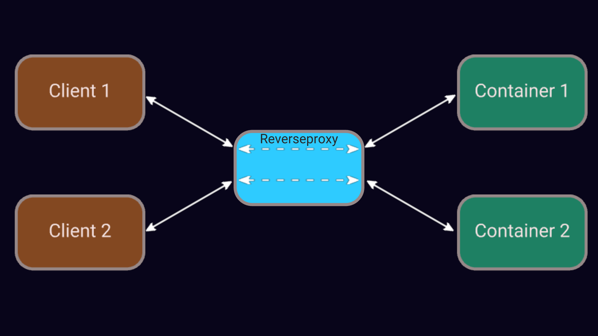

# What is this file about?

In this file, I will try to go step-by-step through the thought processes, 
reasoning and learning that went into this project.

> [!NOTE]
> Always be aware: Other, maybe even better solutions exist!

> [!NOTE]
> For these examples, we will stick to Node-RED Docker-Containers.

# Step 1: IPC (Inter-Process-Communication)

First of all, what do I want to accomplish?

Basically, a Client that connects to my Reverseproxy

At the end of the day, the Client is supposed to communicate with our process (`reverseproxy`) through the internet (i.e. by calling its URL in a Browser such as Firefox).
The method that immediately comes to mind might be: *Sockets*.

At least in Linux and usually other popular Operating Systems you can easily define a socket. 
While defining a socket you usually have to decide on what type of socket you have to use. 
E.g. for Network Communication can tell our socket to speak TCP (or UDP or other protocols).

Operating systems usually provide parameters that give network capabilities to your newly created socket, 
such as `AF_INET` for IPv4 and `SOCK_STREAM` for TCP, thus effectively having a socket that can understand TCP/IP.

> [!NOTE]
> We are creating a TCP/IP socket, 
> because we are assuming that browsers are usually programmed in such a way that they will try to establish communication via a TCP/IP socket.

We will be using Python, because the abstractions are nice to have and will come handy soon enough. 
Also, socket programming in [Python maps directly to the system calls from C](https://realpython.com/python-sockets/#python-socket-api-overview).

<!--
TODO: Very simple synchronous server socket.
TODO: Very simple synchronous client socket.
TODO: Show in the Terminal that the socket communication works.
TODO: Show in the Browser that the Communication works.
-->

> [!IMPORTANT]
> Two sockets (e.g. Browser and Reverseproxy) need to be defined on the same parameters (e.g. `AF_INET` and `SOCK_STREAM`) to communicate with each other.

<!--
TODO: Redefine the Client socket to AF_INET and SOCK_DGRAM.
TODO: Show that both sockets need to have the same parameters in order to successfully communicate with each other.
-->

# Step 2: Can we handle more than one client at the same time?

Let's see what happens if two clients connect *simultaneously*.

<!--
TODO: Example code for two clients.
TODO: Show that the above server cannot handle two or more clients at the same time.
-->

> [!IMPORTANT]
> The above server example cannot handle two or more clients *at the same time*!

## Step 2.1: Parallel programming and concurrency

We can handle more than one client *simultanesouly* if we make use of parallel programming or concurrency.

First, let's take a closer look at parallel programming. 
If you are familiar with C you will know that you can call functions calls from different physical threads (keyword: `pthread`) thus parallelizing your program.
A similar sounding library also exists in Python, which is called `multithreading`.

<!--
TODO: Server Example with multithreading
TODO: Show that 2 clients can be handled simultanesouly
-->

> [!WARNING]
> Despite the multithreading library spawning multiple threads, they unfortunately cannot execute the code in parallel.
> That's because of the Python's so-called GIL (Global-Interpreter-Lock). There are ways to disable the GIL though.

<!--
TODO: Reformatting
TODO: Proof
-->

> [!NOTE]
> To truly run Python code in parallel you can use the multiprocessing library. 
> However, in order to achieve true parallelism the multiprocessing library simply spawns entire new Python interpreters, 
> This unfortunately creates massive overhead.

<!--
TODO: Reformatting
TODO: Proof
-->

Python provides us with a *third* option (actually second, since both `multithreading` and `multiprocessing` spawn new threads).
The *third* option is called `asyncio`. However, it literally runs on exactly one single thread.
Yes, the downside is that we now have even *less* parallelism than before, 
however the upside is that it has less overhead than creating entire new threads.

You can imagine `asyncio` like your operating system running the scheduler on exactly one single thread.
As of now, I don't see myself capable enough to provide a concise explanation.
Thankfully there is a YouTube video which helped me immensely in understanding Python's async programming.

Another upside of Python's `asyncio` module is that it provides us with simpler helpful abstractions for socket programming.

<!--
TODO: Rewrite server in asyncio.
TODO: Rewrite client in asyncio.
TODO: Show.
-->

# Step 3: Spawning a Node-RED Docker-Container when one client connects

# Step 4: Reverseproxy (for only one client)

# Step 5: Making sure that one client doesn't spawn *infinite* Docker-Containers

# Step 5.1: A rather exotic issue: Malicious client

# Step 6: Reverseproxy (for multiple clients)

# Step 7: Saving server disk space

# Step 8: Reverseproxy (we finally did it!)

# Step 9: Accessories